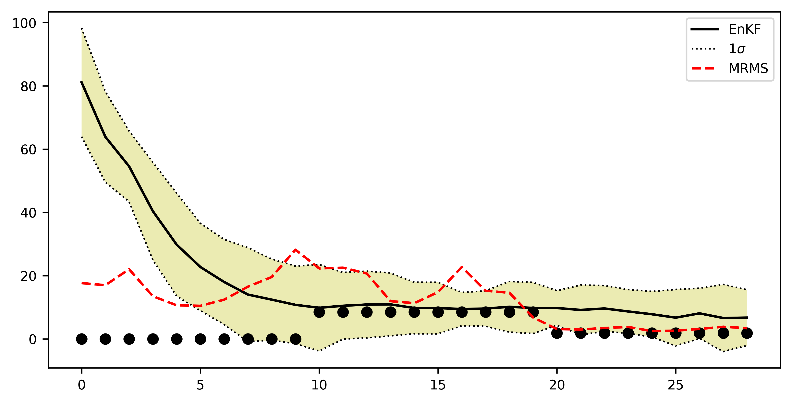

# Ensemble Nowcast

## Radar echo extrapolation

This repo explores the feature of generating ensemble nowcast for CREST-iMaP

The recipe here is to blend NWP model and radar echo extrapolating.

Some preliminary result here. However, it requires further assessments on the ensemble methods.

## Blending Extrapolation with NWP results

We attempt to use ensemble Kalman filter to blend NWP simulated precipitation data and MRMS

Here is the result:

As it can be seen, the result is much closer compared without ensemble Kalman filter.